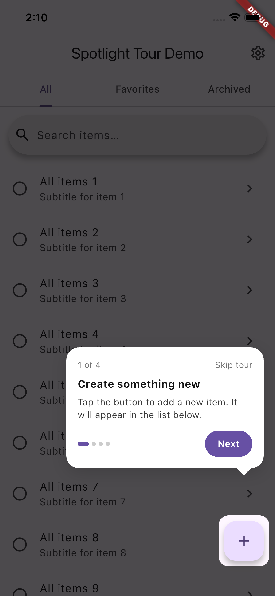
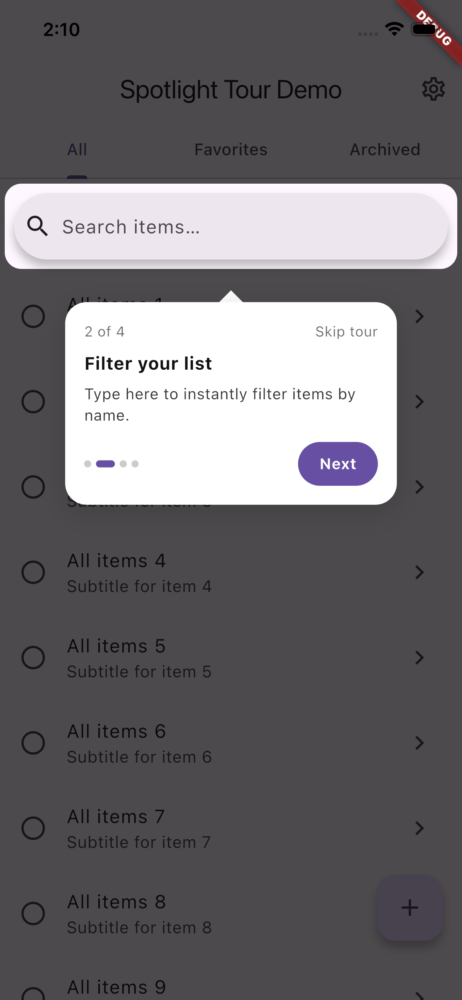
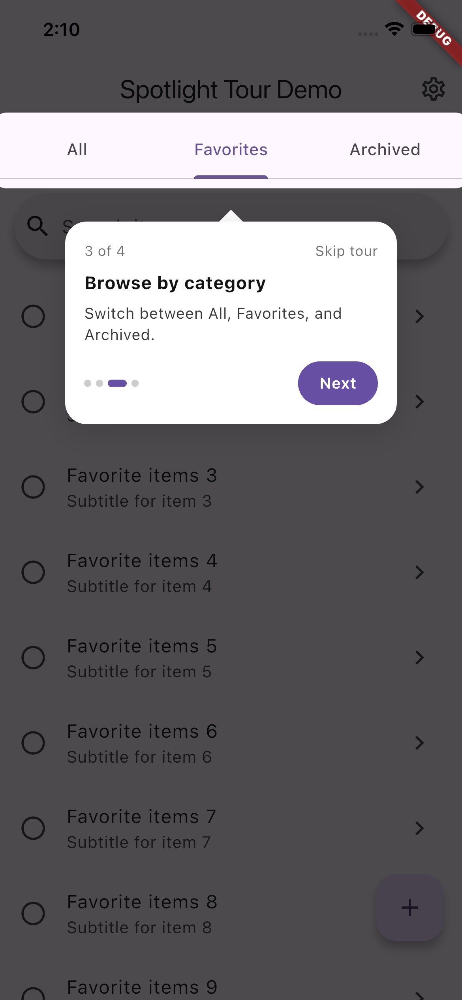
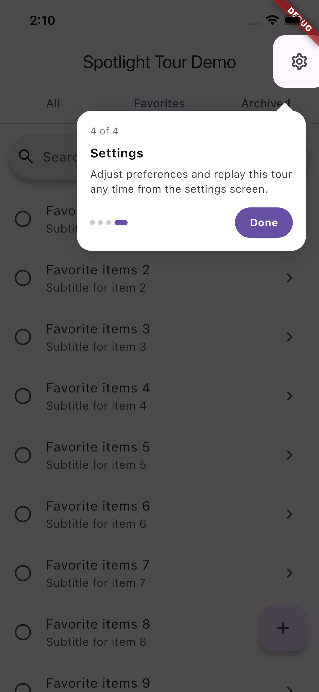

# flutter_spotlight_tour

A lightweight, themeable Flutter onboarding tour with spotlight cutouts, animated tooltips, auto-scroll, tab/page navigation support, and per-screen persistence.

## Screenshots

| Step 1 — FAB | Step 2 — Search | Step 3 — Tabs | Step 4 — Settings |
|:---:|:---:|:---:|:---:|
|  |  |  |  |

---

## Features

- **Spotlight cutout** — dims the entire screen except the target widget
- **Auto-scroll** — calls `Scrollable.ensureVisible` before each step so items inside lists are always in view
- **Tab & page navigation** — `onBefore` hook lets you switch tabs or navigate before a step renders
- **Persistent "seen" state** — uses `shared_preferences` so tours don't re-appear after the first view
- **Fully themeable** — override accent color, scrim opacity, card styles, spotlight shape, and more
- **Restart / reset API** — reset one tour or all tours (e.g., from a settings screen)
- **Fade animations** — smooth entrance/exit between steps

---

## Getting started

Add the package to your `pubspec.yaml`:

```yaml
dependencies:
  flutter_spotlight_tour: ^0.1.0
```

Then run:

```sh
flutter pub get
```

---

## Usage

### Basic tour

```dart
import 'package:flutter_spotlight_tour/flutter_spotlight_tour.dart';

class HomeScreen extends StatefulWidget {
  const HomeScreen({super.key});

  @override
  State<HomeScreen> createState() => _HomeScreenState();
}

class _HomeScreenState extends State<HomeScreen> {
  final _fabKey = GlobalKey();
  final _listKey = GlobalKey();

  @override
  void initState() {
    super.initState();
    // Start the tour after the first frame so all keys are attached.
    WidgetsBinding.instance.addPostFrameCallback((_) {
      Tour.show(
        context: context,
        id: 'home_screen_v1', // unique ID for persistence
        steps: [
          TourStep(
            targetKey: _fabKey,
            title: 'Create something new',
            body: 'Tap here to add a new item to your list.',
          ),
          TourStep(
            targetKey: _listKey,
            title: 'Your items',
            body: 'Everything you create appears here.',
          ),
        ],
      );
    });
  }

  @override
  Widget build(BuildContext context) {
    return Scaffold(
      floatingActionButton: FloatingActionButton(
        key: _fabKey,
        onPressed: () {},
        child: const Icon(Icons.add),
      ),
      body: ListView(
        children: [
          ListTile(key: _listKey, title: const Text('First item')),
        ],
      ),
    );
  }
}
```

---

### Theming

Override any part of the visual style via `TourTheme`:

```dart
Tour.show(
  context: context,
  id: 'branded_tour',
  theme: TourTheme(
    accentColor: Colors.deepPurple,
    scrimOpacity: 0.75,
    cardColor: Colors.grey.shade900,
    titleStyle: const TextStyle(
      color: Colors.white,
      fontSize: 16,
      fontWeight: FontWeight.bold,
    ),
    bodyStyle: const TextStyle(color: Colors.white70, fontSize: 13),
    spotlightRadius: 16,
    spotlightPadding: 12,
    cardRadius: 20,
  ),
  steps: [ /* … */ ],
);
```

---

### Tab / page navigation with `onBefore`

Use `TourStep.onBefore` to switch tabs or navigate before the step is shown:

```dart
TourStep(
  targetKey: _searchBarKey,
  title: 'Search anything',
  body: 'Use the search bar to find items instantly.',
  onBefore: () async {
    _tabController.animateTo(1); // switch to the Search tab
    await Future.delayed(const Duration(milliseconds: 300));
  },
),
```

---

### Callbacks

```dart
Tour.show(
  context: context,
  id: 'settings_tour',
  steps: [ /* … */ ],
  onEnd: () async {
    // Called when tour completes OR is skipped.
    print('Tour finished');
  },
  onSkip: () async {
    // Called only when the user taps "Skip tour".
    print('User skipped');
  },
);
```

---

### Forcing a tour to re-show

```dart
Tour.show(
  context: context,
  id: 'home_screen_v1',
  force: true, // ignores the "already seen" flag
  steps: [ /* … */ ],
);
```

---

### Reset tours

```dart
// Reset a single tour so it shows again on the next visit.
await Tour.reset('home_screen_v1');

// Reset every tour in the app (e.g., from a "Replay tutorials" settings toggle).
await Tour.resetAll();
```

---

## API reference

### `Tour.show`

| Parameter | Type | Required | Description |
|-----------|------|----------|-------------|
| `context` | `BuildContext` | ✅ | The overlay context. |
| `id` | `String` | ✅ | Unique key for SharedPreferences persistence. |
| `steps` | `List<TourStep>` | ✅ | Ordered list of steps. |
| `theme` | `TourTheme` | | Visual config. Defaults to a neutral green theme. |
| `force` | `bool` | | Show even if already seen. Default `false`. |
| `onEnd` | `Future<void> Function()?` | | Called after any tour ending. |
| `onSkip` | `Future<void> Function()?` | | Called only on explicit skip. |

### `TourStep`

| Field | Type | Description |
|-------|------|-------------|
| `targetKey` | `GlobalKey` | Attach this to the widget you want spotlighted. |
| `title` | `String` | Headline shown in the card. |
| `body` | `String` | Explanatory text below the title. |
| `padding` | `double?` | Per-step spotlight padding (overrides theme). |
| `radius` | `double?` | Per-step spotlight corner radius (overrides theme). |
| `onBefore` | `Future<void> Function()?` | Async action run before this step renders. |

### `TourTheme`

| Field | Default | Description |
|-------|---------|-------------|
| `accentColor` | `0xFF00B140` (green) | Button and progress-dot color. |
| `scrimOpacity` | `0.65` | Background dimming. |
| `cardColor` | white | Tooltip card background. |
| `titleStyle` | bold, 15 pt | Card headline style. |
| `bodyStyle` | 13 pt, 1.4 height | Card body style. |
| `captionStyle` | 12 pt, grey | Step counter and skip label. |
| `cardRadius` | `14` | Tooltip card corner radius. |
| `spotlightRadius` | `12` | Cutout corner radius. |
| `spotlightPadding` | `8` | Extra space around the target widget. |

---

## Additional information

- **Issues & feature requests:** [github.com/ooluseye16/flutter_spotlight_tour/issues](https://github.com/ooluseye16/flutter_spotlight_tour/issues)
- **Contributions** are welcome — please open an issue first to discuss significant changes.
